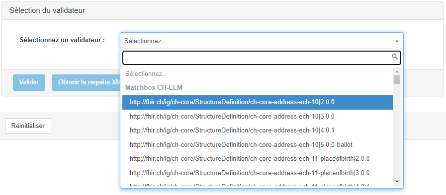

The blog post describes the implementation of the new validation API for the Gazelle EVS Client in Matchbox.
It explains the motivation behind adopting the new API, such as native integration, reduced configuration work,
and increased performance.
The post details the steps taken to investigate the API, implement it using Spring Web MVC, and process validation 
requests.
It also highlights the testing process and collaboration with the Gazelle team, concluding with a successful
integration tested during the IHE Europe Connectathon.

## About Gazelle and the EVS Client

[Gazelle](https://www.ihe-europe.net/testing-IHE/gazelle) is an ecosystem of integrated tools designed to support 
interoperability testing and conformance assessment for health information technology systems.
The Gazelle platform is developed by the team at [Kereval](https://www.kereval.com), for
[IHE Catalyst](https://ihe-catalyst.net) and integrates various components.
[Matchbox](https://www.matchbox.health) is part of the Gazelle Ecosystem of tools.

Gazelle is used by IHE Catalyst to organize [Connectathons](https://www.ihe.net/testing/connectathon/), where 
vendors and developers can test their implementations against each other.
Gazelle is also used by various national health agencies, like Switzerland's 
[eHealth Suisse](https://www.e-health-suisse.ch/), to test their national integration profiles.

The EVS Client is one of the technical components of Gazelle; its name is the acronym of _External Validation
Service_.
It is the component that offers a unified interface (both graphical -- GUI -- and programmatic -- API) to both users 
and other components.
It contains the configuration of all available validators, and stores the results of all validations performed.

The team at Kereval is refactoring major parts of Gazelle, including the EVS Client, to improve its usability, 
efficiency, and capabilities.
A new validation API is being developed to allow interfacing other specialized validators in the EVS Client GUI.

## About Matchbox

Matchbox is an open-source FHIR server based on the
[HAPI FHIR JPA Server Starter](https://hapifhir.io/hapi-fhir/docs/server_jpa/introduction.html) and developed by 
[ahdis](https://www.ahdis.ch).
It offers several key features and functionalities:

1. Implementation Guide Support: Matchbox can pre-load FHIR implementation guides from package servers for
   conformance resources such as StructureMap, Questionnaire, CodeSystem, ValueSet, ConceptMap, NamingSystem,
   and StructureDefinition.
2. Validation: It provides validation support through the [server]/$validate endpoint, allowing users to check
   FHIR resources for conformance with loaded implementation guides.
3. FHIR Mapping Language: Matchbox includes endpoints for creating StructureMaps and supports the StructureMap/$transform operation.
4. Structured Data Capture (SDC): It offers SDC extraction support based on the FHIR Mapping language and Questionnaire/$extract.

Matchbox is designed to be a versatile FHIR server solution, catering to various deployment scenarios and offering
robust support for FHIR implementation guides and related operations.
It would be a valuable addition to the EVS Client's list of supported validators, offering validation of FHIR-based 
IHE profiles like [MHD](https://profiles.ihe.net/ITI/MHD/index.html),
[PDQm](https://profiles.ihe.net/ITI/PDQm/index.html) or [PCF](https://profiles.ihe.net/ITI/PCF/index.html).

## Investigating the new API

The team at Kereval is developing a new  to interface validators in the EVS Client.
Matchbox is already integrated through the FHIR validation operation, but using the new API will bring many benefits 
through a native integration.
The new API:

- decreases the configuration work, as the EVS Client is now able to discover the supported profiles
  automatically; the FHIR validation operation required the user to configure the server's URL and the profiles to
  validate;
- increases the performance of the validation process, as the EVS Client will be able to send multiple
  items to validate in a single request; the FHIR validation operation supported only one item per validation request;
- allows the EVS Client to display more information about the validation process, like the loaded
  implementation guides or the parameters used for the validation in additional metadata; while the information is 
  also returned in the FHIR validation response, it is displayed as a validation message instead;
- decouples the API from the FHIR version, since the FHIR validation operation uses versioned FHIR resources; we can now
  run Matchbox with FHIR R5 only for example, without needing to reimplement the validation operation for each FHIR 
  version in the EVS Client.

Advantages of the new API are clear, and we decide to implement it in Matchbox.
The first step is to investigate the API and understand its structure and requirements.
The documentation is still scarce, but the first version of the API is already implemented in the EVS Client.
Some of its components are available in open-source repositories:

- [Gazelle/Library/validation service api](https://gitlab.inria.fr/gazelle/library/validation-service-api):
  a library that provides all required APIs to build and integrate a new validation service with Gazelle Test Bed.
- [Gazelle/Public/Validation/HTTP Validator](https://gitlab.inria.fr/gazelle/public/validation/http-validator):
  an HTTP validation engine that implements the new validation service API.

In the validation service API repository, the webservice definition can quickly be found in the
[ValidationApiWS](https://gitlab.inria.fr/gazelle/library/validation-service-api/-/blob/master/validation-jaxrs-api/src/main/java/net/ihe/gazelle/validation/interlay/ws/ValidationApiWS.java)
class.
It provides useful information about the API design and that particular implementation.
We can see two endpoints in it, `POST /validate` and `GET /profiles`, along with the models
for the requests and responses, and some OpenAPI annotations.
The webservice is defined with [Jakarta RESTful Web Services](https://projects.eclipse.org/projects/ee4j.rest) 
(JAX-RS), in the new `jakarta` namespace.

```java {hl_lines="10 16" title="Structure of ValidationApiWS.java"}
package net.ihe.gazelle.validation.interlay.ws;
import jakarta.ws.rs.*;
import jakarta.ws.rs.core.Response;

public interface ValidationApiWS {
    @POST
    @Path("/validate")
    @Produces({"application/json", "application/gzl.validation.report+json"})
    // @Schema(implementation = ValidationReportDTO.class)
    Response createValidationRequest(ValidationRequest validationRequest);

    @GET
    @Path("/profiles")
    @Produces({"application/json"})
    // @Schema(type = SchemaType.ARRAY, implementation = ValidationProfileDTO.class)
    Response getValidationProfiles();
}
```

While this implementation seems to provide everything to start developing our interface, I would prefer not to
depend on these dependencies, since Matchbox is already dependent on [HAPI FHIR](https://hapifhir.io/hapi-fhir/) and 
[Spring Boot](https://spring.io/projects/spring-boot).
These two dependencies are responsible for managing the servlet container(s), and they don't implement the
 specification; Spring Web MVC provides its own way to 
[define RESTful services](https://docs.spring.io/spring-framework/reference/web/webmvc/mvc-controller/ann-requestmapping.html).
Adding another dependency to manage the JAX-RS specification would be redundant and could lead to conflicts; luckily,
the Spring Web MVC annotations are very similar to the JAX-RS annotations, and we can easily map the former to the 
latter.

```java {title="Equivalent implementation with Spring MVC"}
package ch.ahdis.matchbox.gazelle;
import org.springframework.web.bind.annotation.*;

@RestController
public class GazelleValidationWs {

    @PostMapping(path = "/validate", consumes = MediaType.APPLICATION_JSON_VALUE, produces = MediaType.APPLICATION_JSON_VALUE)
    public ValidationReport postValidate(@RequestBody final ValidationRequest validationRequest) {
        // Perform validation
    }

    @GetMapping(path = "/profiles", produces = MediaType.APPLICATION_JSON_VALUE)
    public List<ValidationProfile> getProfiles() {
        // List profiles
    }
}
```

That was a simple job, but we still need to implement the models for the requests and responses.
The validation service implement the Data Transfer Objects (DTOs) with really
[Java-esque Design Patterns](https://javadesignpatterns.com/catalog/): there
are interfaces, factories, builders, validators, visitors, mappers between DTOs and Domain Objects, and so on.
We don't really need all that complexity to simply serialize and deserialize the requests and responses from/to
their JSON representation.
There 13 classes in total, quickly built with [Lombok](https://projectlombok.org) annotations (immediately followed 
by Delombok to allow changing the source code in some places) and 3 enums.

While copying the fields from the original classes to the new ones, I noticed that the original classes were not exactly
simple DTOs, but they contained some business logic too.
I will copy some of these methods to the new classes, but I will keep them as simple as possible.

And voilà!
We are pretty much done with the implementation of the new API itself.

## Processing the requests

Now, we need to process requests for both routes and generates meaningful responses to successfully integrate with the 
EVS Client.

### Listing validation profiles

The easiest endpoint to process is the `GET /profiles` route.
It allows the EVS Client to know all validators supported by Matchbox, and show them in the EVS Client GUI.
In FHIR, these validators are called [profiles](https://hl7.org/fhir/R4/profiling.html), and they are used to 
validate FHIR resources.
Looking at the HTTP Validator gives us a first idea of what we need to return in this endpoint.

We list all the profiles loaded in Matchbox, and return them as a JSON array.
We return both the FHIR profile identifier, used by Matchbox to locate the profile, and the FHIR 
[StructureDefinition](https://hl7.org/fhir/R4/structuredefinition.html)'s title, as it is more human-friendly for 
users to select in a list of choices.
We add the profile's version, because [Implementation Guides](https://hl7.org/fhir/R4/implementationguide.html) may 
have multiple versions loaded in Matchbox at the same time, and we need to distinguish between them.
We also add the Implementation Guide id, to allow the EVS Client to filter or group profiles in the interface.
Finally, we filter extensions from the list of profiles, because they are never validated directly.

```json {title="Example of a profile item"}
{
  "profileID": "http://fhir.ch/ig/ch-core/StructureDefinition/ch-core-practitioner-epr|4.0.1",
  "profileName": "CH Core Practitioner EPR (4.0.1)",
  "domain": "ch.fhir.ig.ch-core",
  "coveredItems": []
}
```

The following image shows the list of validation profiles, as displayed currently in the EVS Client GUI.



### Validating items

The second endpoint, `POST /validate`, is more complex and requires more work.
We receive a list of items to validate against a specific profile, and we need to return a validation report for each 
item.
We start by initializing a [Matchbox engine](https://ahdis.github.io/matchbox/matchbox-engine/) for the given 
profile, and we validate each item with it.

The second step is to convert the FHIR validation report to what is expected by the EVS Client.
Both have a similar but different concepts: for example, FHIR's
[issue severity](https://www.hl7.org/fhir/r4/valueset-issue-severity.html) must be converted to the EVS Client's 
priority, level and severity.
We map the fields as good as we can, and we add some additional information to the report, such as slicing information
when it is available.

Eventually, we add additional metadata to the report, allowing the user to see these information in the EVS Client GUI.
Information like the loaded Implementation Guides and the parameters used for the validation can be helpful to assert 
the validation quality.

```json {title="Example of a validation report"}
{
  "modelVersion": "0.1",
  "uuid": "15634009-cc9f-4670-975b-c9e6697178c6",
  "dateTime": "2024-07-22T15:13:23.287+00:00",
  "disclaimer": "Matchbox disclaims",
  "validationMethod": {
    "validationServiceName": "Matchbox",
    "validationServiceVersion": "3.8.9",
    "validationProfileID": "http://fhir.ch/ig/ch-core/StructureDefinition/ch-core-document|4.0.1",
    "validationProfileVersion": "4.0.1"
  },
  "overallResult": "PASSED",
  "additionalMetadata": [
    {
      "name": "validatorVersion",
      "value": "powered by matchbox 3.8.9, hapi-fhir 7.0.2 and org.hl7.fhir.core 6.3.11"
    },
    {
      "name": "package",
      "value": "ch.fhir.ig.ch-core#4.0.1"
    },
    {
      "name": "profile",
      "value": "http://fhir.ch/ig/ch-core/StructureDefinition/ch-core-document"
    },
    {
      "name": "profileVersion",
      "value": "4.0.1"
    }
    // …
  ],
  "reports": [
    {
      "name": "Validation of item #first",
      "subReportResult": "PASSED",
      "assertionReports": [
        {
          "assertionID": "VALIDATION_VAL_PROFILE_UNKNOWN_NOT_POLICY",
          "assertionType": "InstanceValidator",
          "description": "Profile reference 'http://fhir.ch/ig/ch-elm/StructureDefinition/ch-elm-organization-orderer' has not been checked because it could not be found, and the validator is set to not fetch unknown profiles",
          "subjectLocation": "line 317, column 6, FHIRPath: Bundle.entry[10].resource/*Organization/1Org-KsAbc*/.meta.profile[0]",
          "severity": "WARNING",
          "priority": "RECOMMENDED",
          "result": "FAILED"
        },
        {
          "assertionID": "Bundle_BUNDLE_Entry_NotFound",
          "assertionType": "InstanceValidator",
          "description": "Can't find 'Specimen/1Spec-Specimen' in the bundle (Bundle.entry[5].resource.specimen[0])",
          "subjectLocation": "line 1, column 2, FHIRPath: Bundle",
          "severity": "INFO",
          "priority": "MANDATORY",
          "result": "PASSED"
        }
        // …
      ],
      "subCounters": {
        "numberOfAssertions": 23,
        "numberOfFailedWithInfos": 0,
        "numberOfFailedWithWarnings": 15,
        "numberOfFailedWithErrors": 0,
        "numberOfUnexpectedErrors": 0
      }
    }
  ],
  "validationItems": [
    {
      "itemId": "first",
      "content": "ewogICJyZXNvdXJjZVR5cGUiIDogIkJ1bmRsZSIsCiAgImlkIiA6ICIxYkRvYy1OZWlzc2VyaWFHb25vcnJob2VhZSIsC …",
      "role": "request",
      "location": "localhost"
    }
  ],
  "counters": {
    "numberOfAssertions": 23,
    "numberOfFailedWithInfos": 0,
    "numberOfFailedWithWarnings": 15,
    "numberOfFailedWithErrors": 0,
    "numberOfUnexpectedErrors": 0
  }
}
```

The following image shows a validation report, as displayed currently in the EVS Client GUI.


## Testing the Gazelle EVS Client integration

Now that we have implemented the new API, we need to test it in real conditions.
After discussing with the Gazelle team and iterating on some parts of our implementation, we are provided with access
to a test instance of the latest EVS Client.
We can now test our implementation and verify that it works as expected.

That step is crucial, and we discover a few issues in both Matchbox and the EVS Client.
Most of the fixes are straightforward, and we can quickly deploy a new version of Matchbox.
Only a single issue stays unresolved, because it needs more refactoring in the EVS Client.
Hopefully, it is not blocking, and the next test session gives excellent results.

More recently, the integration was tested more intensively during the
[IHE Europe Connectathon in Trieste](https://connectathon.ihe-europe.net/node/306), in June 2024.
No new issue was uncovered at that occasion, the validator worked well during the whole week.
While it was not the most used validator, it was still a good stress test; furthermore, we were happy not to have to
spend time fixing issues during the Connectathon, where we had already enough work to accomplish.

## Conclusion

The resulting implementation can be seen in the
[package ch.ahdis.matchbox.gazelle](https://github.com/ahdis/matchbox/tree/main/matchbox-server/src/main/java/ch/ahdis/matchbox/gazelle).

In this article, we demonstrated how we implemented the Gazelle EVS Client's new validation API in Matchbox.
We showed how we analyzed existing information about the API, the technical decisions we made to implement it, what were
the main issues we encountered, and how we tested the integration with the EVS Client.

Thanks to an excellent collaboration with the Gazelle team, we were able to discuss various aspects of the API, to get
support and feedback on our implementation, and to report bugs encountered during the testing phase.
This really facilitated the integration of the new API in Matchbox, and we are looking forward to further collaboration.
