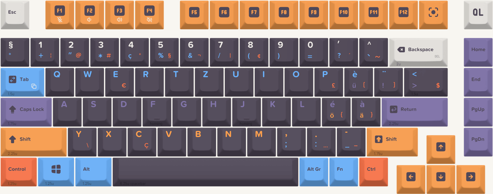

## Introduction

My current keyboard is a nice mechanical keyboard, the Roccat Ryos MK Pro, with a Swiss-French layout.
I have been using it for years, and I am very comfortable with it, but its backlight is starting to fail, and I am 
looking for a replacement.

As a long-time user of the Swiss-French keyboard layout, I never expected to fall in love with a keyboard that fundamentally challenged my typing comfort zone.
The NuPhy Field75 caught my eye with its sleek design and mechanical precision, but there was one significant hurdle: it was only available in the ANSI layout, a stark contrast to my familiar ISO Swiss-French configuration.

This journey isn't just about a keyboard—it's about adaptation, customization, and the intricate world of typing interfaces that most people never think about.
Join me as I navigate the complex landscape of keyboard layouts and transform an ANSI keyboard into my perfect 
typing companion.

## The reasons for change

While my Roccat Ryos MK Pro has served me well, it is starting to show its age.
During my years of use, I have noticed several issues that have prompted me to consider a new keyboard:

- The 100% layout is unnecessarily large and moves the mouse further away. While the numpad is really convenient to 
  process numbers, I don't use it that often, and I could do with the regular number row.
- The backlight is starting to fail, more and more keys are not lighting up anymore.
- The Cherry MX Brown switches are too noisy. While I love their sound and feel, they are not ideal for a shared 
  office space, for night-late typing sessions, or for video calls.

## Choosing the NuPhy Field75

Despite its ANSI limitations, the NuPhy Field75 was irresistible.
Its aluminum frame, hot-swappable switches, and compact 75% layout promised a premium typing experience.
The compact design meant fewer unused keys, and the build quality suggested durability and precision.

The catch?
It is only available in the ANSI layout, a significant departure from my ISO Swiss-French comfort zone.
While I could probably adapt to a new layout over time, this seemed like a poor choice for me:

1. While the ANSI layout is efficient for English typing, it lacks the specific characters and key placements
   essential for Swiss-French language requirements.
2. My laptop, that I use regularly in conjunction with my desktop setup, also follows the ISO Swiss-French layout,
   creating potential confusion and inefficiency.

To make the NuPhy Field75 my own, I initiated a journey of customization and adaptation.
I'd need to reimagine my typing workflow, bridging the gap between my familiar Swiss-French layout and this
beautiful ANSI keyboard.
While researching my customization options, I found two key paths to explore: visual customization and technical
mapping.

This keyboard is available with different types of switches.
To find the right one for me, I ordered the 

## Layout mapping

At first glance, keyboards might seem uniform.
But the differences between the ANSI QWERTY (US) and the ISO QWERTZ (Swiss-french) layouts are quite significant.
Apart from the common alphabet, they present different typing experiences.
Compared to the ANSI, the ISO has:

- a tall, narrower <kbd>Enter</kbd> key shaped like an inverted L;
- longer left <kbd>Shift</kbd> key;
- an additional key between left <kbd>Shift</kbd> and <kbd>Z</kbd>;
- Accommodation for more diverse language characters, mainly with the <kbd>Alt Gr</kbd> key.

).")

).")

I also decided to seize the opportunity to customize the layout to better suit my needs.
There are some specific characters that are quite useful to me, but not present on the layout.
Part of them are the reason I often have to visit [Copy Paste Character](https://copypastecharacter.com), when I forget
an [Alt code](https://en.wikipedia.org/wiki/Alt_code).
Also, without a numpad, I won't be able to enter Alt codes on this new keyboard, so 

Some of the changes to the layout I wanted are:

* <kbd>Alt Gr</kbd> + <kbd>Shift</kbd> + <kbd>C</kbd> give **Ç**;
* <kbd>Alt Gr</kbd> + <kbd>.</kbd> give **…** (ellipsis);
* <kbd>Alt Gr</kbd> + <kbd>Space</kbd> give ' ' (no-break space);
* <kbd>Alt Gr</kbd> + <kbd>Right arrow</kbd> give **→**; the same combination with other arrows.
* <kbd>Alt Gr</kbd> + <kbd>-</kbd> give **–** (en dash);
* <kbd>Alt Gr</kbd> + <kbd>Backspace</kbd> is <kbd>Delete</kbd>;
* <kbd>Fn</kbd> + <kbd>F1-F4</kbd> are sound level/microphone keys;

After multiple rounds of design, here is the final layout I came up with (and ordered):

## Technical mapping: Using VIA for layout customization

The NuPhy Field75 keyboard can be configured with the VIA software.
VIA (Versatile Interface Adapter) is a powerful and user-friendly software tool used for real-time keyboard layout remapping.
It allows users to customize their keyboard layouts without needing to modify the firmware.
VIA provides an intuitive interface for remapping keys, creating macros, and adjusting lighting settings.

With this software, I could remap the NuPhy Field75's keys to match the Swiss-French layout I was accustomed to.

## Visual customization: keycap solutions

Transforming the keyboard's visual ANSI caps became my next challenge.
I was afraid that having invalid legends on the keycaps would be a constant source of confusion and frustration.
The solution lay in custom keycaps: replacing the ANSI keycaps with ones that matched the Swiss-French layout.
I found different providers of custom keycaps, allowing me to design the legends of all the keys.

I went with YUZU keycaps, a provider known for its high-quality custom keycaps.
Their website provides [a playground](https://yuzukeycaps.com/playground) where you can define all the keycaps 
specificities, including the legends, colors, and profiles.

The process to create my own keycaps was straightforward:

1. the NuPhy Field75 is pre-configured in the playground, so I didn't have to worry about the keycap technical 
   specificities.
2. I started with the base kit, the ANSI layout, exactly as it was on the actual keyboard.
3. I then replaced each keycap with the corresponding Swiss-French keycap, adjusting the legends accordingly.
4. I chose a color scheme that matched the keyboard's aesthetic, ensuring a harmonious look.
5. I further customized the keycaps to include special characters and actions that are not present in the ISO layout,
   such as C and ...

The only downside of this solution was the loss of the lighting effect on the keycaps: while the originals are 
shine-through, that is not an option in YUZU.
They have a sister company, FK Custom, 
[that provides shine-through keycaps](https://yuzukeycaps.canny.io/feature-requests/p/shine-thru-clear-and-translucent-dual-layer-key-caps),
but I found their customization tool less user-friendly, the keycaps less appealing, and the customization possibilities
more limited.

## Personal experience and learning curve

## Conclusion
