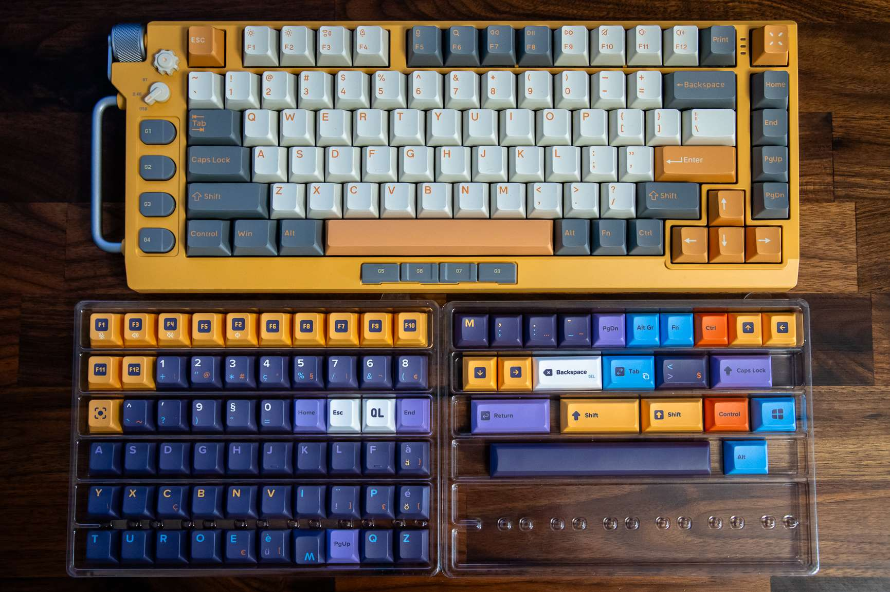
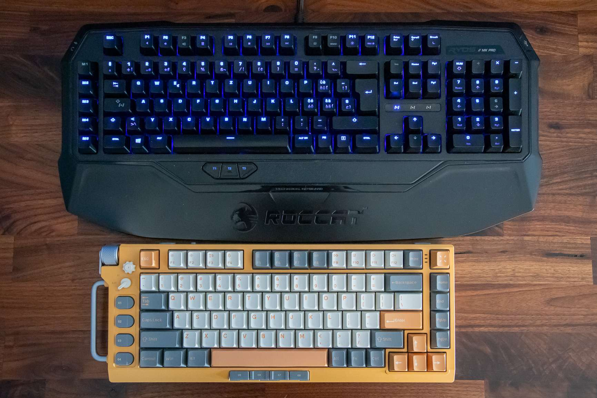
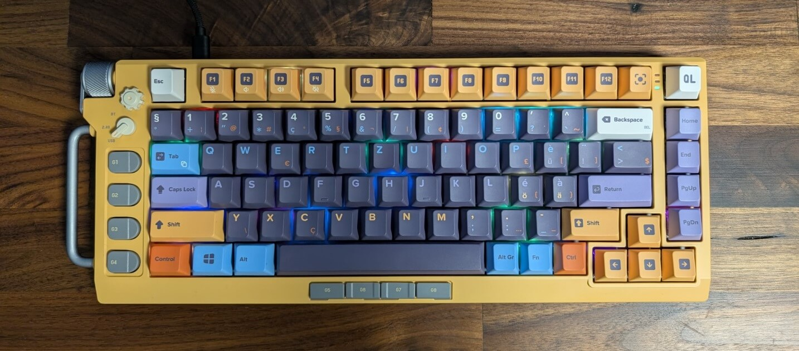

## Introduction

My current keyboard is a nice mechanical keyboard, the Roccat Ryos MK Pro, with a Swiss-French layout.
I have been using it for years, and I am very comfortable with it, but its backlight is starting to fail, and I am 
looking for a replacement.

As a long-time user of the Swiss-French keyboard layout, I never expected to fall in love with a keyboard that fundamentally challenged my typing comfort zone.
The NuPhy Field75 caught my eye with its sleek design and mechanical precision, but there was one significant hurdle: it was only available in the ANSI layout, a stark contrast to my familiar ISO Swiss-French configuration.

This journey isn't just about a keyboard—it's about adaptation, customization, and the intricate world of typing interfaces that most people never think about.
Join me as I navigate the complex landscape of keyboard layouts and transform an ANSI keyboard into my perfect 
typing companion.

## The reasons for change

While my Roccat Ryos MK Pro has served me well, it is starting to show its age.
During my years of use, I have noticed several issues that have prompted me to consider a new keyboard:

- The 100% layout is unnecessarily large and moves the mouse further away. While the numpad is really convenient to 
  process numbers, I don't use it that often, and I could do with the regular number row.
- The backlight is starting to fail, more and more keys are not lighting up anymore.
- The Cherry MX Brown switches are too noisy. While I love their sound and feel, they are not ideal for a shared 
  office space, for night-late typing sessions, or for video calls.

## Choosing the NuPhy Field75

Despite its ANSI limitations, the NuPhy Field75 was irresistible.
Its aluminum frame, hot-swappable switches, and compact 75% layout promised a premium typing experience.
The compact design meant fewer unused keys, and the build quality suggested durability and precision.

The catch?
It is only available in the ANSI layout, a significant departure from my ISO Swiss-French comfort zone.
While I could probably adapt to a new layout over time, this seemed like a poor choice for me:

1. While the ANSI layout is efficient for English typing, it lacks the specific characters and key placements
   essential for Swiss-French language requirements.
2. My laptop, that I use regularly in conjunction with my desktop setup, also follows the ISO Swiss-French layout,
   creating potential confusion and inefficiency.

To make the NuPhy Field75 my own, I initiated a journey of customization and adaptation.
I'd need to reimagine my typing workflow, bridging the gap between my familiar Swiss-French layout and this
beautiful ANSI keyboard.
While researching my customization options, I found two key paths to explore: visual customization and technical
mapping.

This keyboard is available with different types of switches.
To find the right one for me, I ordered the
[Keychron Switch Tester 100 Max Edition](https://keychron.fr/products/keychron-switch-tester-100-max-edition), which 
is a simple box with a hundred different switches from the main manufacturers: Keychron, Cherry, Gateron and Kailh.
It allows to try typing on each of them, and to find the one that suits you best.
You can compare the actuation force (i.e. the key resistance), the tactile feedback, and the sound.

Eventually, I settled on the NuPhy Fleeting Gold switches, which are a tactile switch with a 55g actuation force.
They have similar characteristics to the Cherry MX Brown switches.

The keyboard has been out of stock for a while on the official website, and it's not easy finding it elsewhere.
I finally found some stock on [AliExpress](https://www.aliexpress.com/item/1005005779938228.html), and ordered it 
from there.

## Layout mapping

At first glance, keyboards might seem uniform.
But the differences between the ANSI QWERTY (US) and the ISO QWERTZ (Swiss-french) layouts are quite significant.
Apart from the common alphabet, they present different typing experiences.
Compared to the ANSI, the ISO has:

- a tall, narrower <kbd>Enter</kbd> key shaped like an inverted L;
- longer left <kbd>Shift</kbd> key;
- an additional key between left <kbd>Shift</kbd> and <kbd>Z</kbd>;
- Accommodation for more diverse language characters, mainly with the <kbd>Alt Gr</kbd> key.

).")

).")

I also decided to seize the opportunity to customize the layout to better suit my needs.
There are some specific characters that are quite useful to me, but not present on the layout.
Part of them are the reason I often have to visit [Copy Paste Character](https://copypastecharacter.com), when I forget
an [Alt code](https://en.wikipedia.org/wiki/Alt_code).
Also, without a numpad, I won't be able to enter Alt codes on this new keyboard, so 

Some of the changes to the layout I wanted are:

* <kbd>Alt Gr</kbd> + <kbd>Shift</kbd> + <kbd>C</kbd> give **Ç**;
* <kbd>Alt Gr</kbd> + <kbd>.</kbd> give **…** (ellipsis);
* <kbd>Alt Gr</kbd> + <kbd>Space</kbd> give ' ' (no-break space);
* <kbd>Alt Gr</kbd> + <kbd>Right arrow</kbd> give **→**; the same combination with other arrows.
* <kbd>Alt Gr</kbd> + <kbd>-</kbd> give **–** (en dash);
* <kbd>Fn</kbd> + <kbd>F1-F4</kbd> are sound level/microphone keys;

After multiple rounds of design, here is the final layout I came up with (and ordered):

## Technical mapping: Using software for layout customization

NuPhy provides a software for this single model, the [Field Console](https://nuphy.com/pages/field-console).
After installing it and trying the different features, I'm quite disappointed.
The software is quite bad, it has a raw interface that isn't easy to understand, and seems to be quite limited in its
customization capabilities.
It is quite a shame, because the other keyboards of the brand can be configured online with [VIA](https://usevia.app),
which seems a nice, modern tool.
I will have to find another way to configure the keyboard layout, using it only to remap the media keys.

I tested then the PowerToys Keyboard Manager.
The [PowerToys](https://learn.microsoft.com/en-us/windows/powertoys/) are an amazing set of tools for Windows, and 
should come pre-installed on every Windows machine.
I'm using it on all my machines, so it is a good solution for me.
Unfortunately, it doesn't support all the remapping I need, and it doesn't work reliably in all running applications, 
failing to replace some key inputs.
That's the first time I'm disappointed by PowerToys, but I guess it is because the keyboard is quite special and 
needs to be handled by the operating system itself, not by another application running in user space.

I will then rebind the regular keys with the [Microsoft Keyboard Layout Creator](https://www.microsoft.com/en-us/download/details.aspx?id=102134)
tool.
It works well, allowing to rebind keys for each of their states (normal, shift, alt, alt+shift, etc.), and managing 
dead keys (i.e. keys that don't produce a character on their own, but modify the next key pressed).
I can start from the regular Swiss-French layout, and modify it to my needs.
[The layout being designed](https://gist.github.com/qligier/3073086844356a440039acb9894a261e) can be tested, and 
once you are happy with it, you can compile it into an executable that will install the layout on a Windows machine.

I won't get those changes if I connect my keyboard to a Mac or Linux machine, or an unconfigured Windows machine, so
it isn't an ideal solution, but I only expect to use it on my two Windows machines.
The second disadvantage is that the layout must be uninstalled to update it, the software will even refuse to 
compile it if a layout of the same name is already installed.

## Visual customization: keycap solutions

Transforming the keyboard's visual ANSI caps became my next challenge.
I was afraid that having invalid legends on the keycaps would be a constant source of confusion and frustration.
The solution lay in custom keycaps: replacing the ANSI keycaps with ones that matched the Swiss-French layout.
I found different providers of custom keycaps, allowing me to design the legends of all the keys.

I went with YUZU keycaps, a provider known for its high-quality custom keycaps.
Their website provides [a playground](https://yuzukeycaps.com/playground) where you can define all the keycaps 
specificities, including the legends, colors, and profiles.

The process to create my own keycaps was straightforward:

1. the NuPhy Field75 is pre-configured in the playground, so I didn't have to worry about the keycap technical 
   specificities.
2. I started with the base kit, the ANSI layout, exactly as it was on the actual keyboard.
3. I then replaced each keycap with the corresponding Swiss-French keycap, adjusting the legends accordingly.
4. I chose a color scheme that matched the keyboard's aesthetic, ensuring a harmonious look.
5. I further customized the keycaps to include special characters and actions that are not present in the ISO layout,
   such as "Ç", "–" and "…".

The only downside of this solution was the loss of the lighting effect on the keycaps: while the originals are 
shine-through, that is not an option in YUZU.
They have a sister company, FK Custom, 
[that provides shine-through keycaps](https://yuzukeycaps.canny.io/feature-requests/p/shine-thru-clear-and-translucent-dual-layer-key-caps),
but I found their customization tool less user-friendly, the keycaps less appealing, and the customization possibilities
more limited.

## Personal experience and learning curve

Both products were delivered within a reasonable timeframe, and I was eager to test them out.
The packaging was secure, and the products were in perfect condition.
The quality is excellent:

The orange color of the keycaps almost perfectly matches the orange of the keyboard, which is a nice touch.
It was really hard to properly evaluate colors on the YUZU website, but I'm happy with the result.

The keyboard is definitively smaller than the Roccat Ryos MK Pro, I'll gain some space on my desk:

After replacing the keycaps, the keyboard is now ready to be tested:

The switches are much quieter, it will be better for people listening to it during video calls.
The backlight is also visible, although it doesn't shine through the keycaps as much as I would have liked.
It should still be helpful in a dark room, as the keycaps don't fully block the light.

Changing my typing habits from the ISO Swiss-French layout to the ANSI layout is not that hard for the most part.
Keys are mainly in the same place, and the differences are not that big, so I can write text almost as fast as before.
The biggest change is the <kbd>&lt;</kbd> key, which is now between <kbd>Backspace</kbd> and <kbd>Enter</kbd>; I often 
use it involuntarily, but I'm getting used to it.

Coding with it is a bit more difficult though, because it requires more special characters that have changed place, 
like braces, the dollar sign, or the loss of slash and star on the numpad.
This will take more time to adapt to, but I'm confident I'll get there.

## Conclusion

There are a number of keyboard manufacturers that don't offer the ISO layout, or all language variants of it (and 
there are many!).
Getting a keyboard in the ANSI layout and customizing it to your needs is a possibility, but it requires some work 
before ordering it and some adaptation after receiving it.
