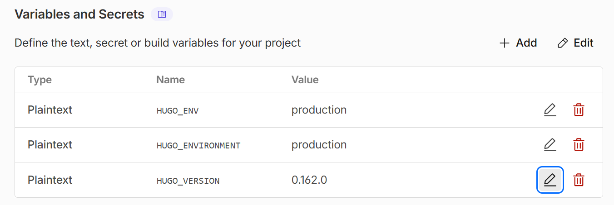

I deploy this blog on Cloudflare Pages, but I also run CI on GitHub to run a test build and get notified of any issue
when I push a commit.
I always expected both environments to be the same, so I was surprised when I noticed the Cloudlfare Pages build wasn't
being deployed anymore.
The GitHub CI was alright, but I just updated some Hugo features to the latest version.

A quick investigation revealed that Cloudflare was running an older version of Hugo (v0.147.7 at the time of writing,
while v0.162.0 is already out).
What is unexpected is that the user has no apparent control over Hugo: there's no setting related to it that I could
find, and we don't control the build environment (contrary to the GitHub action where we install the version we want).

The solution, given by the [Cloudflare Docs](https://developers.cloudflare.com/pages/framework-guides/deploy-a-hugo-site/#use-a-specific-or-newer-hugo-version),
is to create an environment variable named `HUGO_VERSION` with the value of the version we want to use: e.g. `0.162.0`.
The deployment logs should confirm it:

```
Detected the following tools from environment: hugo@extended_0.162.0
Installing hugo extended_0.162.0
* Downloading hugo release extended_0.162.0...
hugo extended_0.162.0 installation was successful!
```

Other sources also show that you can add the `extended_` prefix, but in my tests, the extended version is always
installed (e.g. `0.162.0` is equivalent to `extended_0.162.0`).
I also tested `latest` (as it's quite conventional), without success.
A plus for providing the extended version by default, but immediately offset by the hassle of updating.


