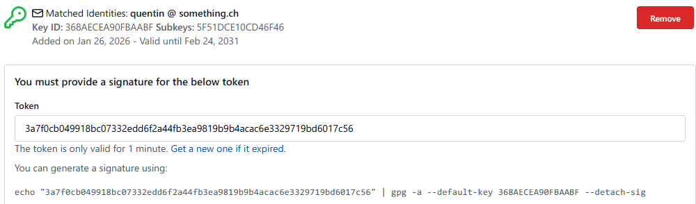

I recently created a user account on a Forgejo/Gitea instance, as I wanted to contribute to a project hosted on that
platform.
To keep a coherent Git setup across the different development platforms, I wanted to add my SSH and GPG keys, and 
discovered that Forgejo/Gitea requires a verification step to ensure the ownership of the keys.
This verification step involves signing a specific single-use token with the respective key and then submitting the
generated signature back to Forgejo/Gitea.

This step proved a bit harder than expected, especially since I wanted to perform the operations using PowerShell 7 on
Windows.
The instructions provided by Forgejo/Gitea could be greatly improved, and the single-use token is only valid for 
one minute, leaving very little room for error.
Here is how I managed to successfully verify both my SSH and GPG keys.

## Verifying the SSH key

Adding the SSH key is quite simple, as it only requires providing my public key.
Then, the following form is presented to verify the ownership of the key:


A PowerShell command is provided to sign the token using the `ssh-keygen` utility, but it's in fact calling the 
standard Windows command prompt `cmd.exe`.
The mixed use of different shells can be confusing, especially when it comes to quoting strings: I couldn't find a 
way to pass the private key file path when it contained spaces.

Fortunately, it can be simplified to the following command:

```powershell {title="Signing the unique token with ssh-keygen"}
"9d8b5221ef28e244bce062ccb8a51b503f1723ae0f2a0d45c6b806b809156c7d" | ssh-keygen -Y sign -n codeberg.org -f "C:\Users\Quentin\Documents\.ssh\rsa_4096_quentin_keyA"
```

After quickly providing the correct passphrase for my private key, the signature is generated and can be copied back to
the verification form.

## Verifying the GPG key

Adding the GPG key is similar, as it also requires providing the public key.
The verification form is nearly identical to the SSH one, except that only a Unix shell command is provided:



The PowerShell equivalent command to sign the token is as follows:

```powershell {title="Signing the unique token with GPG"}
"3a7f0cb049918bc07332edd6f2a44fb3ea9819b9b4acac6e3329719bd6017c56" | gpg -a --default-key 368AECEA90FBAABF --detach-sig
```

I provide the generated signature back to the verification form, and… it says that the signature is invalid or expired.
After a few failed attempts, I searched online and found [various](https://forum.gitea.com/t/gpg-keys-verify-fail/4162/10)
[threads](https://github.com/go-gitea/gitea/issues/34595) mentioning that issue on Windows.
The root cause seems to be a difference on how the shell is handling strings, maybe related to line endings.
Playing with the `Out-String` cmdlet to remove or change the line ending of the token string didn't yield any result, 
so I asked Copilot for alternatives, and it delivered a simple but working solution:

```powershell {title="Signing the unique token with GPG on Windows"}
[Text.Encoding]::UTF8.GetBytes("3a7f0cb049918bc07332edd6f2a44fb3ea9819b9b4acac6e3329719bd6017c56") | gpg -a --default-key EF39F845FB551D535051CD64368AECEA90FBAABF --detach-sig
```

That worked perfectly.
I'm quite happy with this change, it's simple enough and not much longer than the original command.
